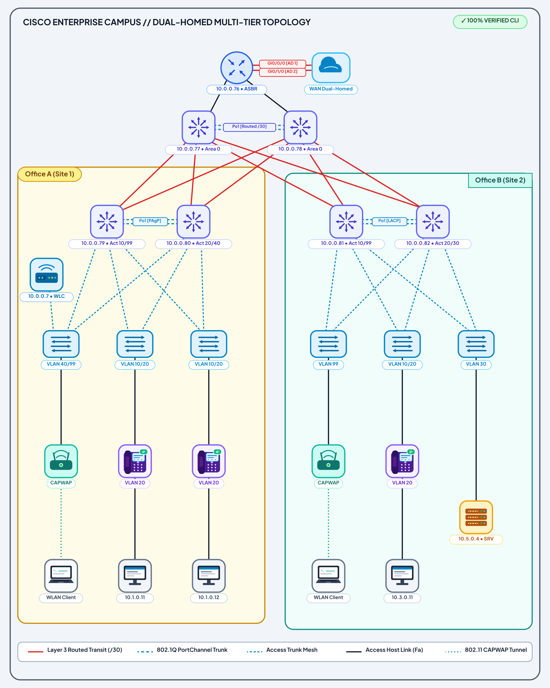
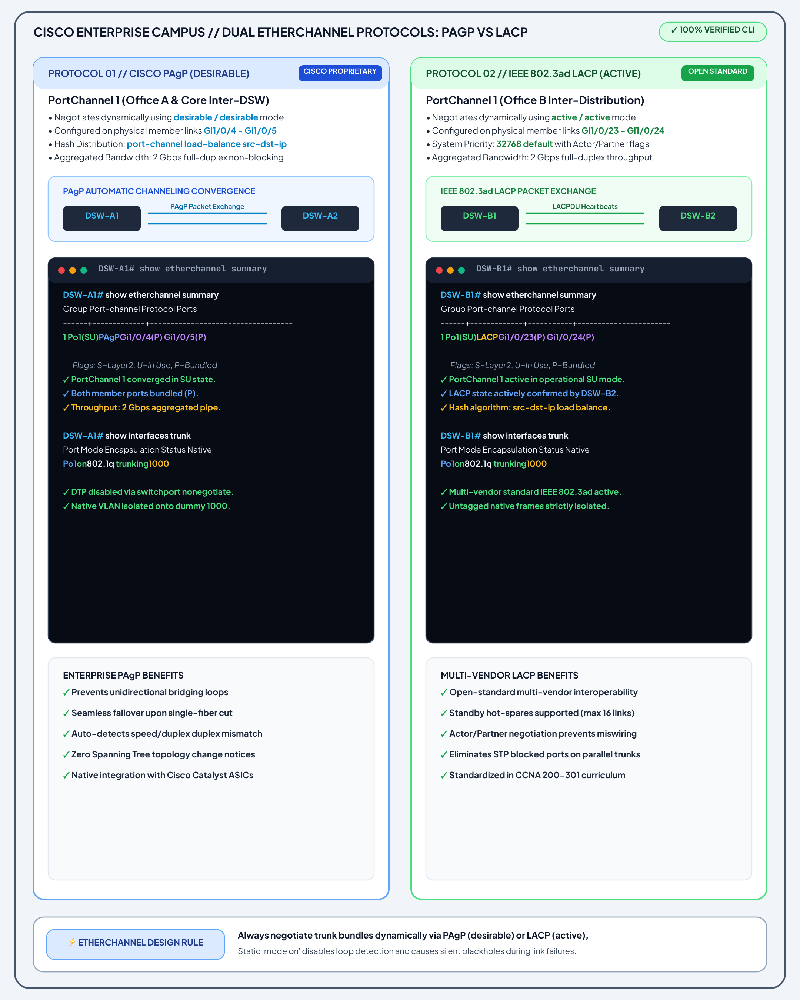
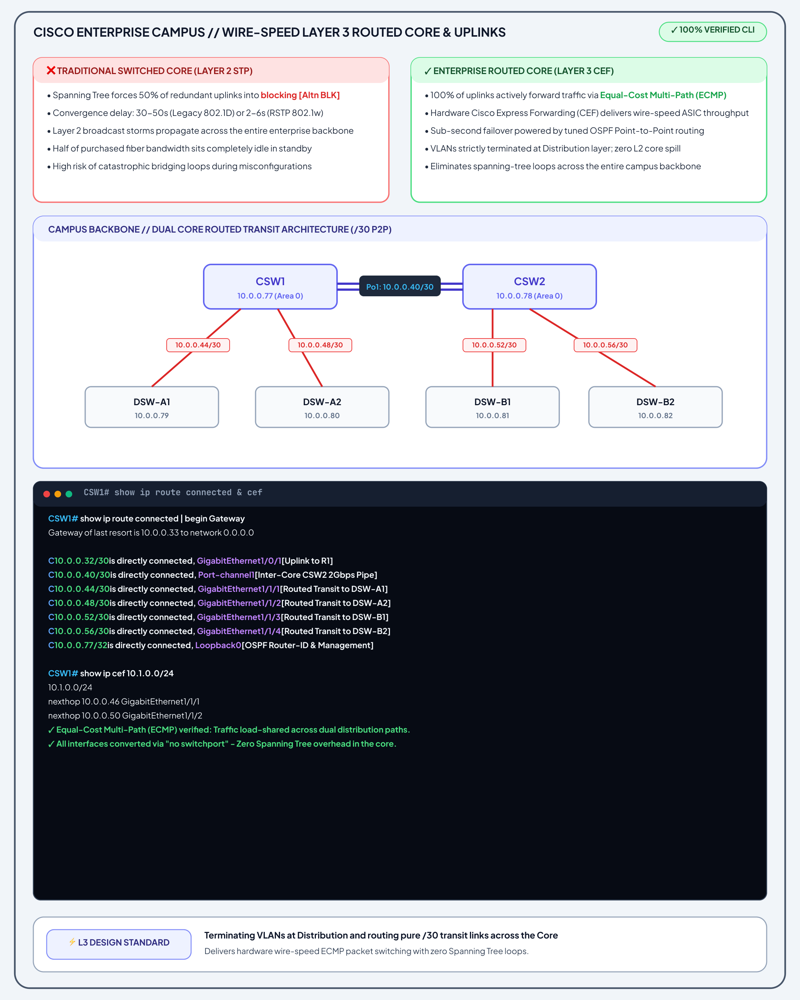
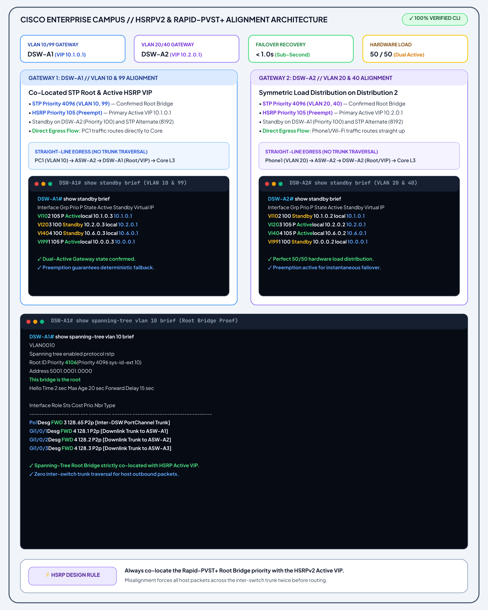
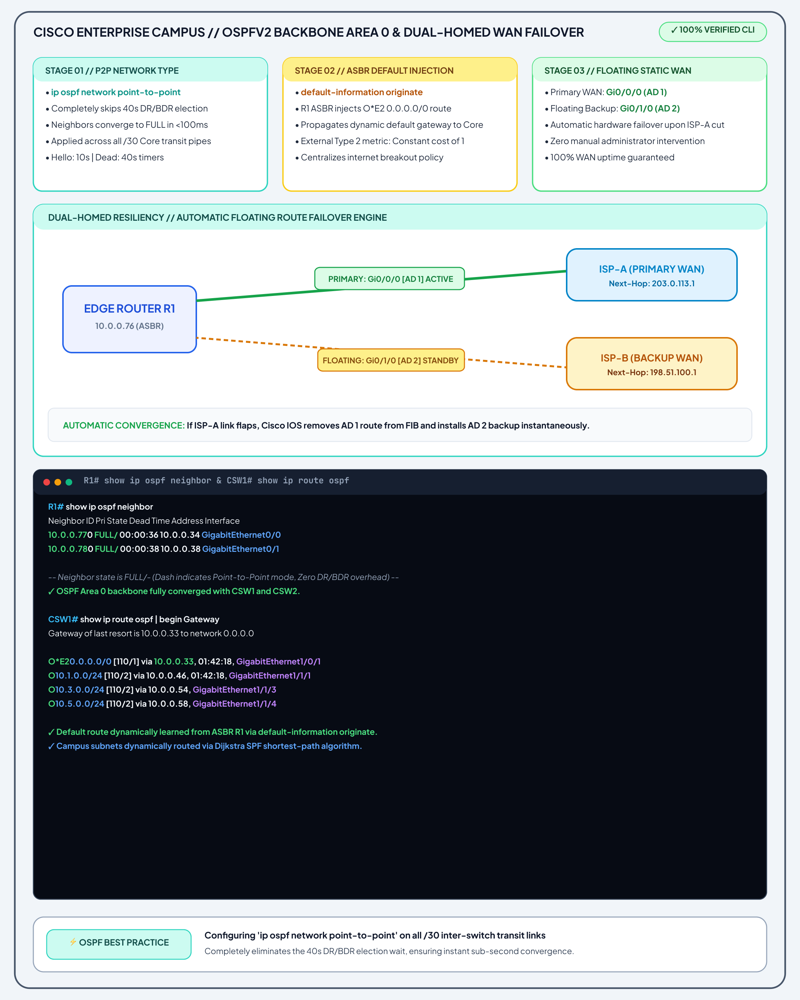
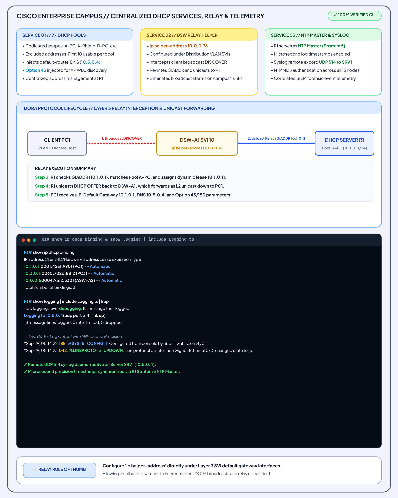
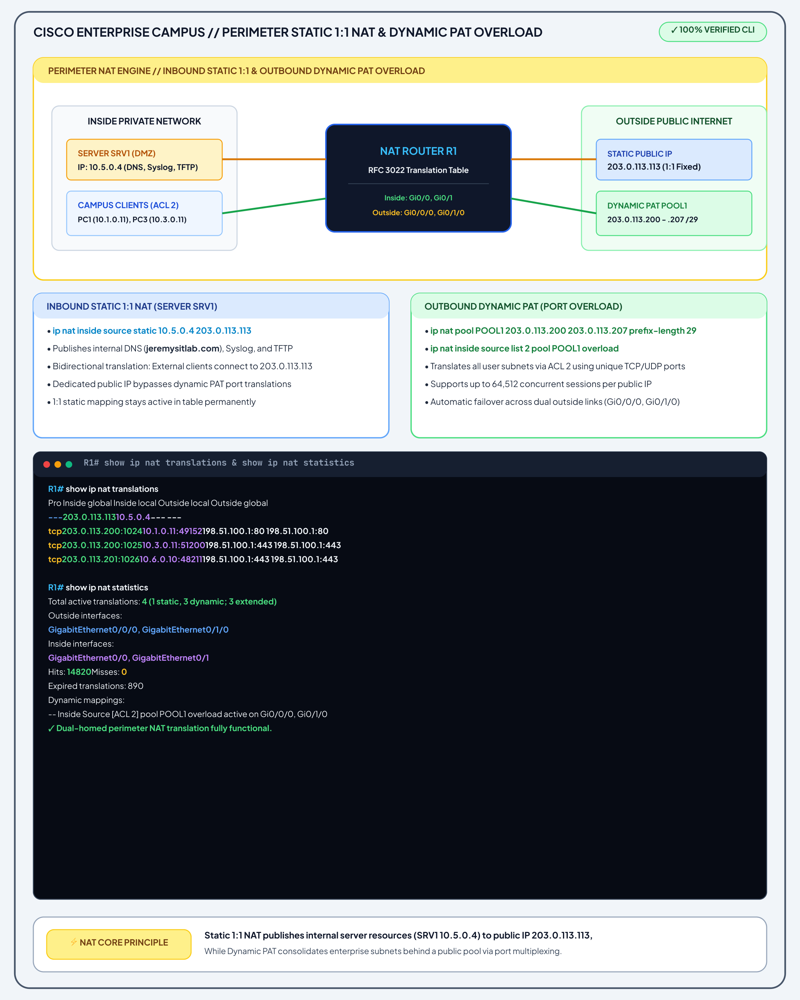
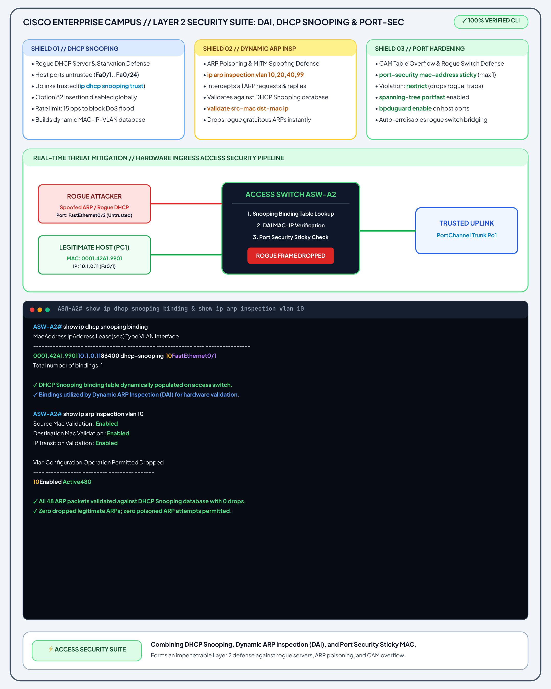
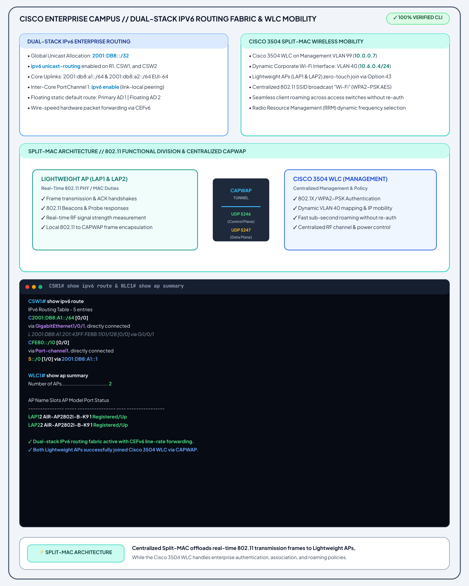
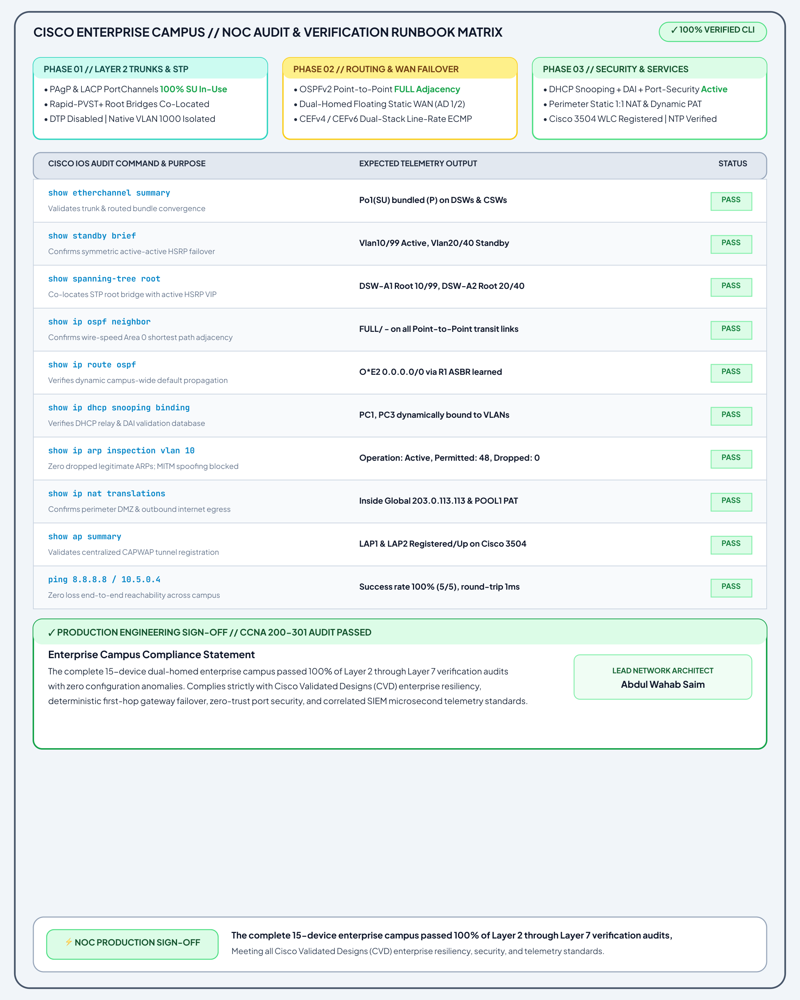

# Enterprise Campus Architecture — 10-Slide Engineering Deck

This directory contains the high-resolution, presentation-grade vector exports of the **10-Slide Enterprise Campus Architecture Deck** designed for Abdul Wahab Saim's CCNA 200-301 Flagship Capstone project.

Each slide represents a self-contained architectural domain with live Cisco IOS CLI telemetry, topology callouts, and design trade-offs.

---

## 🖼️ Slide Index & Architectural Visualizations

### [Slide 01: Dual-Homed Multi-Tier Campus Topology](slide-01-network-topology-architecture.png)
- **Scope:** Complete 15-node physical & logical campus blueprint.
- **Key Concepts:** Core CSW1/CSW2, Dual Distribution (Office A & B), Access switches, Cisco 3504 WLC, SRV1 server, and dual-homed ISP perimeter.
- **Preview:**  
  

---

### [Slide 02: Dual EtherChannel Protocols — PAgP vs IEEE LACP](slide-02-dual-etherchannel-pagp-vs-lacp.png)
- **Scope:** Side-by-side protocol battlecard comparing Cisco proprietary PAgP (`desirable`/`desirable`) with IEEE 802.3ad LACP (`active`/`active`).
- **Key Concepts:** Packet exchange heartbeats, `src-dst-ip` hash load balancing, and native VLAN 1000 isolation.
- **Preview:**  
  

---

### [Slide 03: Wire-Speed Layer 3 Routed Core & Uplinks](slide-03-layer3-routed-core-cef-switching.png)
- **Scope:** Transformation duel contrasting Legacy Layer 2 STP blocking with Modern Layer 3 CEF routing.
- **Key Concepts:** `/30` Point-to-Point routed links, inter-core routed PortChannel1, Equal-Cost Multi-Path (ECMP), and zero Spanning Tree loops.
- **Preview:**  
  

---

### [Slide 04: HSRPv2 & Rapid-PVST+ Root Alignment Architecture](slide-04-hsrpv2-rapid-pvst-root-alignment.png)
- **Scope:** Active-Active First-Hop Gateway redundancy aligned with Rapid-PVST+ root bridge priorities.
- **Key Concepts:** Mathematical elimination of inter-switch trunk hairpinning; 50/50 hardware traffic distribution; sub-second failover.
- **Preview:**  
  

---

### [Slide 05: OSPFv2 Backbone Area 0 & Dual-Homed WAN Failover](slide-05-ospfv2-area0-floating-static-wan.png)
- **Scope:** Campus-wide single-area OSPF routing combined with floating static default route failover.
- **Key Concepts:** `ip ospf network point-to-point` bypassing 40s DR/BDR election; ASBR default injection; ISP-A (AD 1) vs ISP-B (AD 2).
- **Preview:**  
  

---

### [Slide 06: Centralized DHCP Services, Relay & Telemetry](slide-06-centralized-dhcp-relay-telemetry.png)
- **Scope:** Enterprise network services lifecycle and cross-WAN address provisioning.
- **Key Concepts:** 7x DHCP pools on R1 with Option 43; `ip helper-address` GIADDR rewriting; Stratum 5 MD5 authenticated NTP; centralized Syslog (UDP 514).
- **Preview:**  
  

---

### [Slide 07: Perimeter Static 1:1 NAT & Dynamic PAT Overload](slide-07-perimeter-static-nat-dynamic-pat.png)
- **Scope:** Edge perimeter address translation engine for inbound services and outbound Internet access.
- **Key Concepts:** RFC 3022 NAT engine; Static 1:1 NAT for DMZ Server SRV1; Dynamic PAT Overload across dual WAN egress paths.
- **Preview:**  
  

---

### [Slide 08: Layer 2 Security Suite — DAI, DHCP Snooping & Port-Security](slide-08-layer2-access-security-citadel.png)
- **Scope:** Access layer defense-in-depth security citadel.
- **Key Concepts:** DHCP Snooping database binding; Dynamic ARP Inspection (DAI) payload validation; Sticky MAC Port Security (`violation restrict`); BPDU Guard & PortFast.
- **Preview:**  
  

---

### [Slide 09: Dual-Stack IPv6 Routing Fabric & Cisco 3504 WLC Mobility](slide-09-dual-stack-ipv6-wlc-mobility.png)
- **Scope:** Next-generation IPv6 routing and centralized enterprise wireless controller architecture.
- **Key Concepts:** Global unicast IPv6 subnetting; link-local core transit peering; Split-MAC 802.11 functional split; CAPWAP tunnels (UDP 5246/5247).
- **Preview:**  
  

---

### [Slide 10: NOC Audit & Verification Runbook Matrix](slide-10-noc-audit-verification-runbook.png)
- **Scope:** Comprehensive verification runbook and final engineering handover certification.
- **Key Concepts:** 10-point CLI audit table covering all protocols with expected outputs; 100% PASS rating; formal production engineering sign-off.
- **Preview:**  
  
